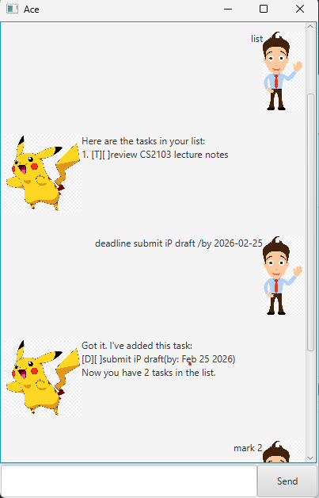

# Ace User Guide

Ace is a desktop task manager that helps you manage todos, deadlines, and events using simple commands.

## Quick Start

1. Launch the app.
2. Type a command in the input box.
3. Press `Send`.

## Features

### Add a todo

Adds a todo task.

Format: `todo <description>`  
Alias: `t <description>`

Example:
- `todo review CS2103 notes`

### Add a deadline

Adds a task with a due date.

Format: `deadline <description> /by <yyyy-MM-dd>`

Example:
- `deadline submit iP draft /by 2026-02-25`

### Add an event

Adds a task with a start and end time.

Format: `event <description> /from <start> /to <end>`

Example:
- `event project consultation /from 3pm /to 4pm`

### List tasks

Shows all tasks.

Format: `list`  
Alias: `ls`

### Mark task as done

Marks a task as completed.

Format: `mark <task number>`  
Alias: `mk <task number>`

Example:
- `mark 2`

### Unmark task

Marks a task as not completed.

Format: `unmark <task number>`  
Alias: `um <task number>`

Example:
- `unmark 2`

### Delete task

Deletes a task by number.

Format: `delete <task number>`  
Alias: `rm <task number>`

Example:
- `delete 1`

### Find tasks

Finds tasks containing a keyword.

Format: `find <keyword>`

Example:
- `find project`

### Exit

Closes the app.

Format: `bye`